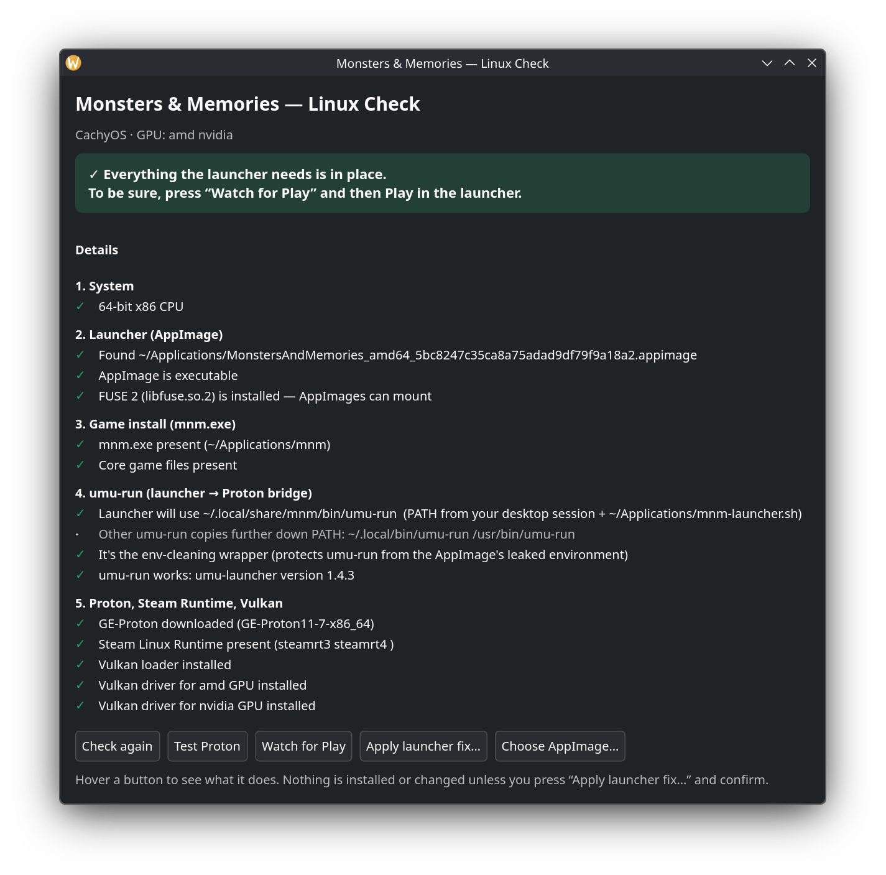

# MnM on Linux

Set up, play and troubleshoot Monsters & Memories on Linux with the official Linux launcher (AppImage). It gets the launcher and `umu-run` for you, applies the fix the launcher needs on Linux, starts the game with your graphics settings, and when something goes wrong it checks everything the launcher needs and tells you exactly what to do about it, with commands for your distro and GPU.

Unofficial community tool, not made, affiliated with or endorsed by the Monsters & Memories team.



## Use it

1. Download **`mnm-on-linux.py`** from the [latest release](../../releases/latest).
2. Double-click it, or run it in a terminal:

   ```sh
   python3 mnm-on-linux.py
   ```

3. Follow the steps. The window shows one step at a time with one button; when they're all done it shows **Play**.

Nothing is downloaded, installed or changed until you press a button and confirm. Commands that need your password are never run for you: the window shows them with a **Copy** button.

### Steps

In order, skipping any that are already done (a line at the bottom shows ✓ done, ● current, ○ still to do):

1. **Get the official launcher**: downloads it into `~/Games/MonstersAndMemories`, or choose a file you already have.
2. **FUSE 2**, only if it's missing: a copyable command to run in a terminal (it needs your password).
   **Allow Proton's sandbox**, only on the rare systems that turn off user namespaces: also a copyable command.
3. **Install umu-run**: its single-file version into `~/.local/bin`, no password.
4. **Apply the launcher fix** (or **Update fix** if you have an older one).
5. **Install the game**: opens the launcher; sign in and press Install there.

If the game's Wine folder is damaged (empty system files after a crash during the first start), a **Repair** step comes first. Then the window shows **Play**, which opens the official launcher with the launcher fix and your Settings, and shows whether the launcher or game is running.

The buttons at the top open the other pages; **← Back** returns to the steps:

| Page | What it does |
| --- | --- |
| Settings | Graphics card on computers with two GPUs, DXVK or WineD3D, native Wayland, HDR, MangoHud and GameMode. Saved to `~/.config/mnm-on-linux/settings.conf` and used the next time the game starts. |
| Troubleshoot | The full launcher check, with the buttons below. |
| About | Version, update check (updates replace the file after you confirm), links. |

### Troubleshoot buttons

| Button | What it does |
| --- | --- |
| Check again | Re-runs every check. Read-only. |
| Test Proton | Runs a harmless Windows command through `umu-run` in the game's prefix, without starting the game. The first run may download GE-Proton (about 500 MB). |
| Watch for Play | Waits up to 10 minutes for you to press Play, then confirms the game really started, shows which GPU it renders on, and, if it hangs, shows what Proton printed. |
| Apply launcher fix… | Installs a small `umu-run` wrapper and launch script that stop the AppImage's environment from crashing `umu-run` (the "nothing happens" bug), and apply your Settings. Writes only to your home folder. |
| Copy report | Copies the whole result as text, to paste into a [bug report](../../issues/new/choose) or Discord. Personal data is left out (see below). |
| Choose AppImage… | Use this if your launcher AppImage isn't in `~/Games`, `~/Applications`, `~/Downloads` or a similar folder. |

Upgrading from the old **Linux Check** (v1)? Press **Update fix** when the window shows it so the wrapper uses your Settings. The old fix keeps working until then.

## What it checks

1. 64-bit x86 CPU
2. The launcher AppImage: found, executable, FUSE 2 installed
3. Game files (`mnm.exe` and core files) next to the AppImage
4. `umu-run`: on the launcher's `PATH`, actually runs, wrapper in place
5. GE-Proton, the Steam Linux Runtime, the Vulkan loader, a Vulkan driver for your GPU (and AMDVLK conflicts), and laptops with two GPUs
6. The game's Wine prefix
7. Errors in the launcher's last log
8. Python and PyGObject/GTK

## Requirements

Python 3 (`umu-run` needs it too) plus PyGObject with GTK 4 or 3 for the window. GNOME, Ubuntu, Linux Mint, Fedora, Bazzite and SteamOS usually have these already. If they're missing, the check shows the command for your distro, and the window falls back to the terminal check (no steps, Settings or Play there).

- Terminal only: `python3 mnm-on-linux.py --cli` (supports `--test`, `--watch`, `--fix`, `--appimage PATH`), or run `mnm-linux-check.sh` with bash.
- For a bug report from the terminal: `python3 mnm-on-linux.py --cli --watch --report` prints the result without personal data.

| Distro | Install command |
| --- | --- |
| Arch, CachyOS, Manjaro, EndeavourOS | `sudo pacman -S --needed python python-gobject gtk4` |
| Ubuntu, Linux Mint, Debian, Pop!_OS | `sudo apt install python3 python3-gi gir1.2-gtk-4.0` |
| Fedora, Nobara | `sudo dnf install python3 python3-gobject gtk4` |
| openSUSE | `sudo zypper install python3 python3-gobject-Gdk typelib-1_0-Gtk-4_0` |

### Laptops with two GPUs

On laptops with an integrated plus a discrete GPU, the game can start on the slow integrated GPU, or sit on "Game is running" with no window (NVIDIA Optimus). The check detects this, and with the launcher fix the game uses the discrete GPU: PRIME render offload on NVIDIA, `DRI_PRIME=1` on AMD/Intel + AMD. Change this under **Settings → Graphics card** ("Always use the fast card" for desktops, "Let the system decide" to turn it off). `MNM_NO_PRIME_OFFLOAD=1` still turns it off too.

### Ubuntu 22.04 and distros based on it

On Pop!_OS 22.04, Linux Mint 21, Zorin OS 17, elementary OS 7 and other Ubuntu 22.04-based systems, the official launcher quits as soon as you open it (`undefined symbol: hb_ot_layout_get_horizontal_baseline_tag_for_script`). It brings its own copy of a text library (Pango) that needs a newer HarfBuzz than these systems have. The launcher fix handles this: there, it starts the launcher with your system's own Pango, so open the launcher from the app menu entry, not from the AppImage file. `MNM_NO_PANGO_PRELOAD=1` turns this off.

### Privacy

The check never shows personal data. Paths in your home folder appear as `~/…`, download IDs in file names as `<id>`, and anything it copies out of logs or tools (Proton/Wine output, error messages) has these removed:

- your user name and computer name
- home folders (`/home/…`, `/var/home/…`, Wine's `Z:\home\…` and `C:\users\…`), and your name in `/run/media/…`
- the launcher's login token, and any `token=`, `password=`, `secret=` or `auth=` values or web tokens
- e-mail addresses, IP and MAC addresses, and machine or download IDs

**Copy report** and `--report` run the whole report through the same filter again before you share it. A report keeps what's useful for fixing problems: your distro, GPU models, and driver, Proton and umu versions.

## Building

`mnm-linux-check.sh` holds the checks and `gui/mnm_check_gui.py` holds the window. Run `./build.sh` to combine them into the single file `dist/mnm-on-linux.py`.
